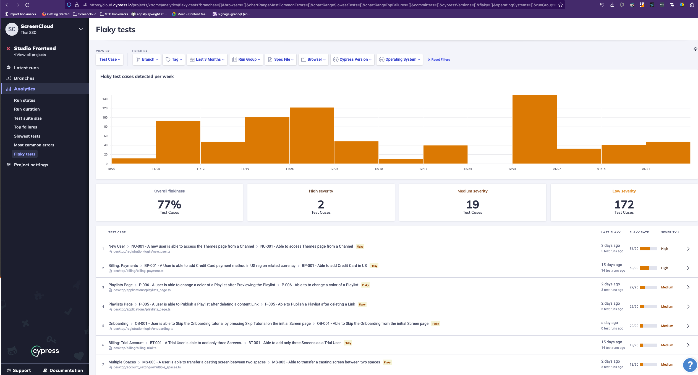
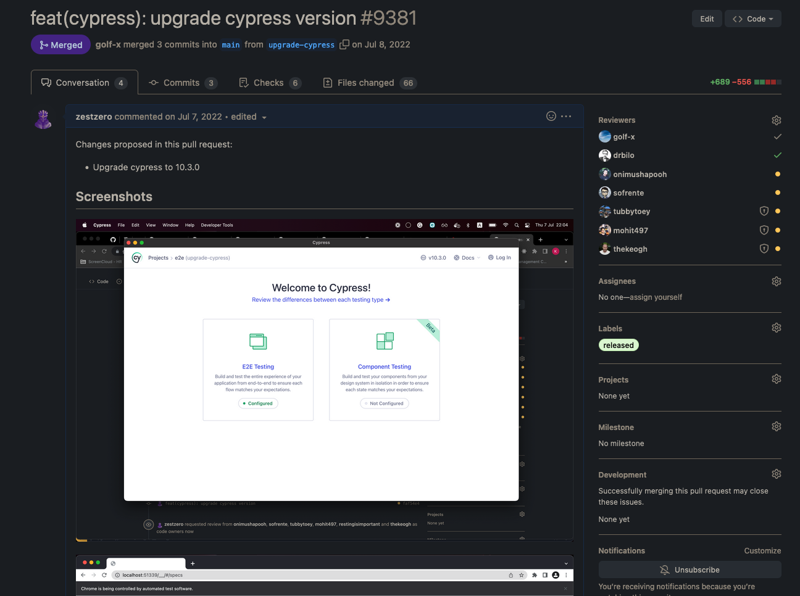
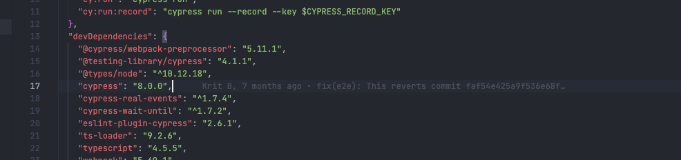
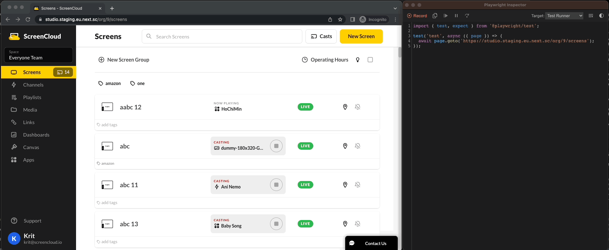
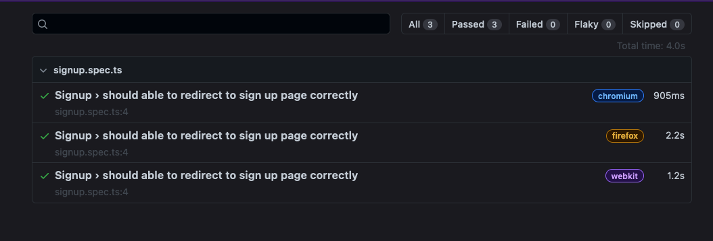

# **Playwright**

> Knowledge sharing and basic code walk through

---


## Playwright ✅
<!-- _class: danger -->
#### not cypress ⛔️

---

Speed 🚀
|  |
---
| [speed comparison](https://blog.checklyhq.com/cypress-vs-selenium-vs-playwright-vs-puppeteer-speed-comparison/) |

---

Cross-Domain support 🔀
|  |
---
| [why favor playwright](https://medium.com/tech-p7s1/why-favor-playwright-over-selenium-or-cypress-e96df84c08e1) |

---

## Flakiness 😣
<!-- _class: bullet -->
 
- Too many (non) E2E tests
- Class name / HTML tag selectors

---

## Cannot upgrade 😓



---


---

<!-- _class: invert -->
## 🌟 Key features 🌟

---

## Test Generator

- Generate test in real time!

---
### Generated Code

```ts
import { test, expect } from '@playwright/test';

test('test', async ({ page }) => {
  await page.goto('https://studio.staging.eu.next.sc/org/9/screens');
  await page.getByRole('link', { name: 'Channels' }).click();
  await page.getByText('16Zones (Test) Published16Zones').click();
  await page.getByTestId('add-content-button').click();
  await page.locator('.media-checked').first().click();
  await page.getByTestId('button-picker-action').click();
});
```
---
<!-- _class: invert -->
## Debugging


---

## Reporter
```shell
$ npx playwright test --reporter=html
```

with build-in github action support 💖

---

## And many more!
- [Parallel](https://playwright.dev/docs/test-parallel) run test in parallel/serial for speed
- [Visual comparisons](https://playwright.dev/docs/test-snapshots) take snapshot and compare
- [Test fixtures](https://playwright.dev/docs/test-fixtures) group tests based on their meaning
- [Mock APIs](https://playwright.dev/docs/mock) mock API request / modify response

---


